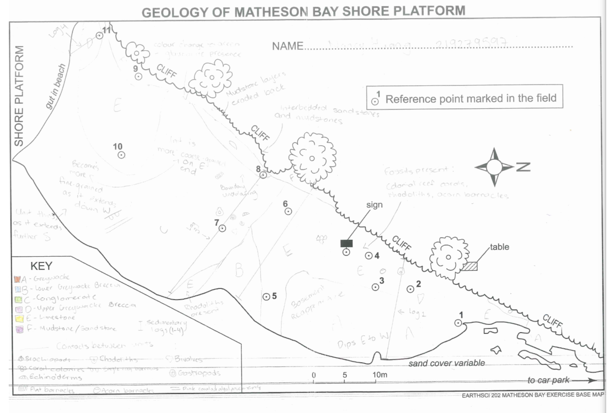
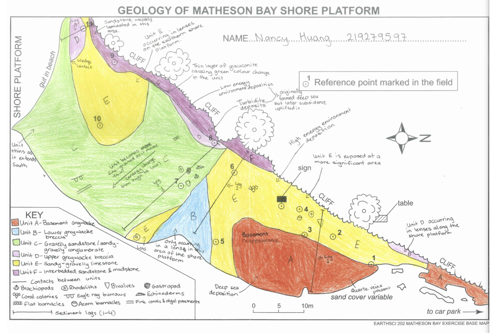
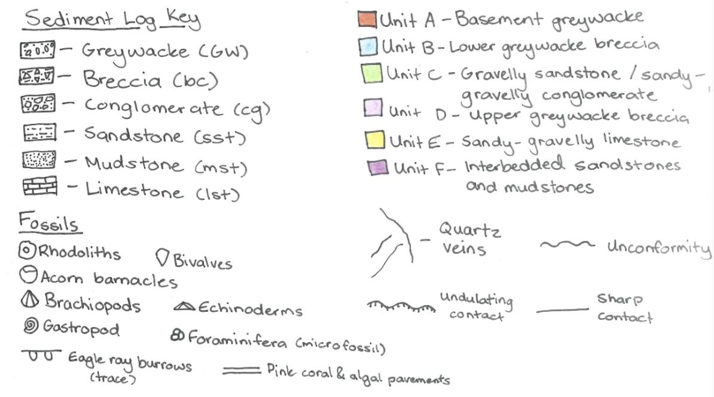
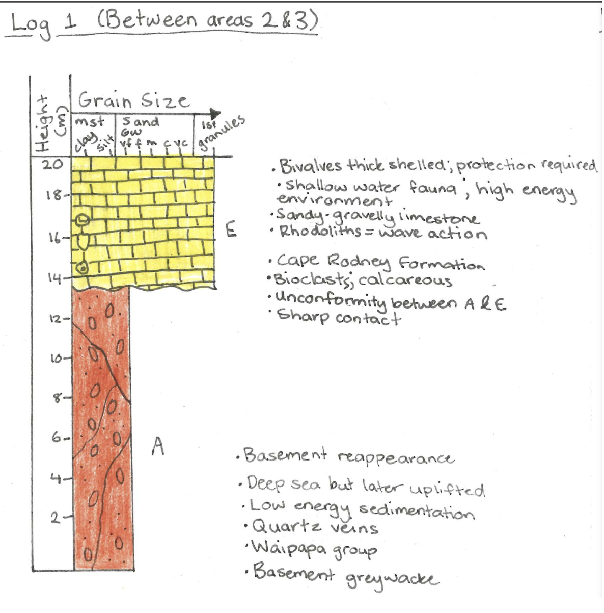
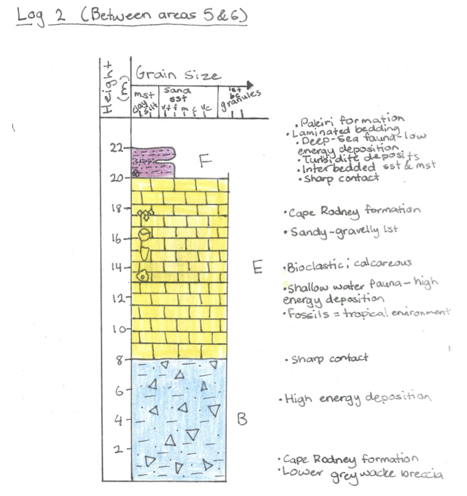
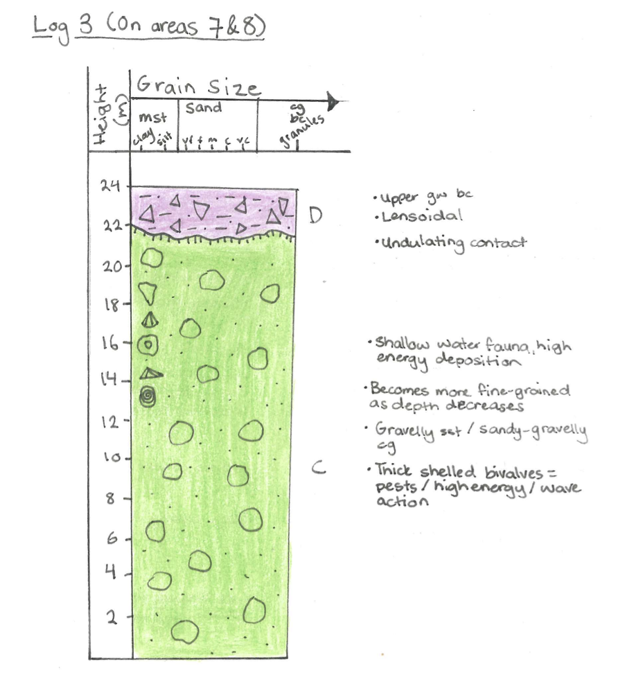
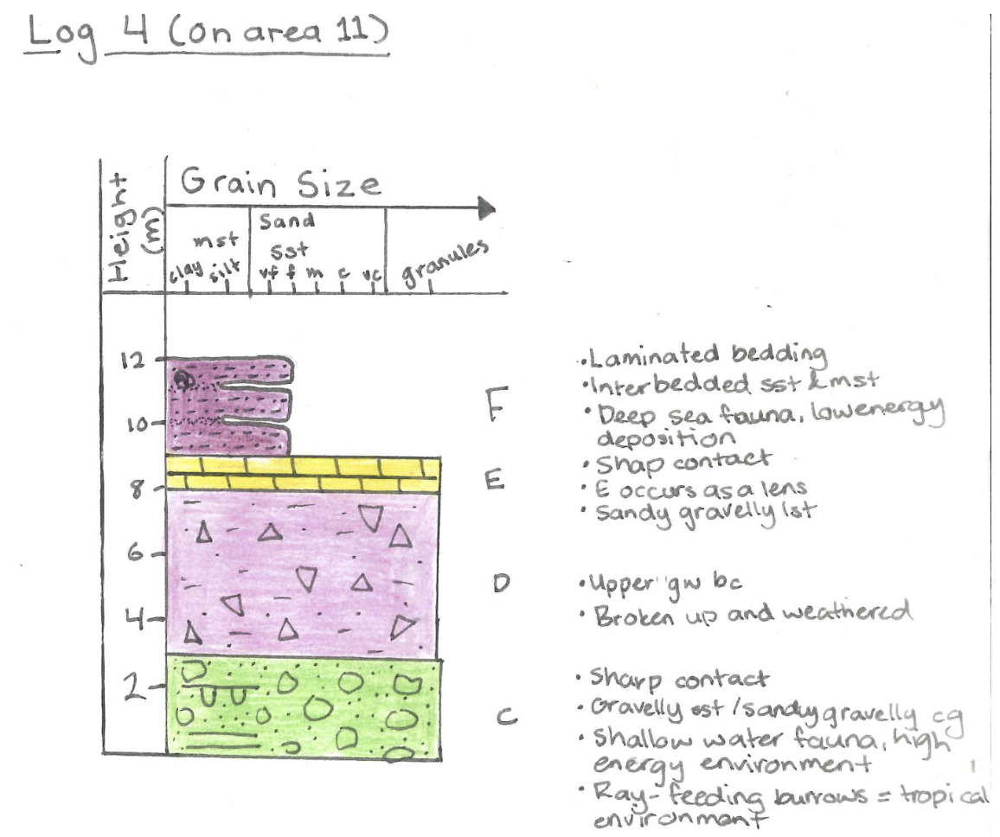

```{r setup, include=FALSE}
knitr::opts_chunk$set(echo = FALSE)
```
Welcome to my Matheson Bay assignment that I did as part of EARTHSCI 202: Earth History! This assignment was a combination of field work and data analysis, where geological data was collected at Matheson Bay, and then used afterwards to develop a refined geological interpretation for the field site. 

Through this assignment, I gained and developed my field work skills including sedimentological logging and geological mapping. I then refined my research skills by using field work data to create a summary of the area's geological history. 

**Maps; Field and Good**

We started off in the field with a blank map, where we explored the geology of the area, looking at boundaries/contacts of lithologies and the appearances of fossil assemblages in each unit. We then mapped the position and boundaries of the six units, then mapped the fossil assemblages within each unit. In the field we also created sedimentological logs along the bay, documenting the thicknesses of units, fossil assemblages within units, and the type of contacts that separate the units. 

Next, using the base map done in the field, I was able to create a coloured, good copy of the map to use as reference in the geological interpretation. In this map the lithological contacts and fossil assemblages are highlighted, along with annotations that support field analyses. 


**Sedimentological Logs**

Here are the good copies of the sedimentological logs done at Matheson Bay. For the locations logging was done at, please refer to the good map. For the logs, we were asked to provide annotations for the units, describe the contacts of units, indicate maximum grain size of unit, and fossil assemblages. 










**Lithologic Descriptions**

In the field, we took lithological descriptions of each unit that we saw, providing details of their composition, texture, colour, and other lithological details. 

**WAIPAPA GROUP**

Unit A – Basement greywacke

● Sedimentary

● Muddy sandy composition

● Dark grey in colour

● Metamorphosed to an extent, deformed and fractured forming quartz veining

● Fine grained, hard, strong, well sorted


**WAITEMATA GROUP, WARKWORTH SUBGROUP, CAPE RODNEY FORMATION**

Unit B – Lower greywacke breccia 

● Sedimentary

● Clast supported, very coarse grained, uneven clasts, poorly sorted, fine grained matrix

● Greywacke clasts; original source from Unit A – monomictic; clasts from just greywacke unit

Unit C – Gravelly sandstone/sandy-gravelly conglomerate

● Sedimentary

● Uneven clasts, matrix supported, poorly sorted, medium to coarse grained

● Polymictic; clasts contain greywacke, gravel, pebbles with a sandy matrix

● Fossils; gastropods, bivalves, brachiopods, eagle ray-feeding burrows (trace), pink corals and algal pavements, flat barnacles, echinoderms – most fossiliferous unit; shallow water fauna, high energy environment, tropical warm environment

Unit D – Upper greywacke breccia

● Sedimentary

● Clast supported, very coarse grained, uneven clasts, poorly sorted, fine grained shell matrix

● Greywacke clasts; monomictic, original source Unit A

Unit E – Sandy-gravelly limestone

● Sedimentary

● Limestone composition of calcium carbonate shells; main supply of sediment come from shells

● Calcareous, moderately sorted, fine to coarse grained

● Weathered and fractured along joints

● Fossils; colonial reef corals, rhodoliths, acorn barnacles – tropical, warm, high energy environment

**WAITEMATA GROUP, WARKWORTH SUBGROUP, PAKIRI FORMATION**

Unit F – Interbedded sandstone and mudstone

● Sedimentary

● Mudstone; fine grained, well sorted, soft, light brown

● Sandstone; well sorted, hard, quartz clasts, light brown and white,

● Unweathered area

● Authigenic mineral presence; glauconite, causing green colour change, indicating low sedimentation rates

● Bluff forming material

● Microfossils present in sediment; foraminifera – deep sea fossils ~1000m depth


Finally, with the data collected and external references, I was able to compile a succinct geological history at Matheson Bay, discussing the tectonic evidence, changing depositional environments, paleoecology, and sea level changes. 

**Geologic History of Mathesons Bay**

Mathesons Bay is an area with a profound geological history, subject to seismic, tectonic, and sea level changes, with a distinct division between deep sea depositional environments and shallow depositional environments. Evidence of such events are explored through the various lithologies and by understanding the paleoenvironmental conditions.

The oldests rocks come from our basement greywacke (unit A), which we see on the northern end of the map, and reappearing as we head further southeast, making up the Waipapa Group. The greywacke sand layers were initially deposited by turbidity currents from sediments derived from the erosion and volcanic activity of Gondwana. Intense deformation via movements deep into the Earth’s crust where hot mineralised water is forced through the cracks in the greywacke, causing the quartz veins along various parts of the unit. This deformation causes the greywacke to have a heavily fractured appearance, particularly where it is exposed in the northern/north eastern ends of the shore platform (Morton, 1993). The eventual uplift and paleotopography has meant that the greywacke in certain areas is more elevated, and tends to disappear and reappear, like how it’s present in the northern end, then reappearing eastward on the map. A basal nondeposition unconformity throughout the early Miocene subsequent transgression created drowned valleys, steep cliffs, islands and sea stacks, somewhat resembling the modern coastline, which is what it would’ve looked like right up till the deposition of the Waitemata group (Ricketts., et al, 1989)

The next four depositions form the Cape Rodney formation in the Kawau Subgroup in the early Miocene, with the lower greywacke breccia being the oldest of the four (unit B). We only see it occurring in a small lens on the east of the shore platform, and only occurring at a topographic low because it gets eroded from the topographic highs of the basement, then being redeposited at decreased elevations. This is also why it is monomictic; the only source was that basement greywacke, so those clasts are all from the same source.

The sandstone/gravelly conglomerate (unit C) takes up a large portion of the southern shore platform of the bay, containing the bulk of the fossils. At this point water level has likely risen slightly, so energy is slightly lower, causing a change in grain size where the unit is more submerged, as seen in sediment log 3, as depth decreases so does grain size. We have similar depositional processes to unit B, so we see it occurring again at the topographic lows, forming an irregular contact between the two units. It continues to fill accommodation spaces driven by subsidence or potentially sea level rise, and eventually we start seeing lateral flats along the unit. Large, thick shelled oysters are found cemented to the rocks to suggest an exposed subtidal, shallow water environment (Eagle., et al, 1999), along with shell thickness implying potential predators for bivalve species. Barnacles often reside on hard substrates, which potentially could include the bivalve shells, which is present in this unit, also known as a transitional fossil. The presence of gastropods, rhodoliths, corals, and eagle ray feeding burrows indicate that the early Miocene saw a tropical climate, in order to support that type of fauna, due to their requirement for warmer temperatures and sunlight. Echinoderms can also be seen in this unit, suggesting an intertidal zone throughout this unit, which would make sense with the slight rise in water level.
 
The upper greywacke breccia (unit D), which is Auckland-wide, formed on the base of a large-scale seismic event, which sent large boulders of greywacke tumbling down, creating our greywacke clasts, which is also why we see it in lenses along the shore platform. The convergence boundary is also forming as a result of the formation of the subduction zone. Subduction began pulling Auckland down, forming the basin, increasing sea levels, and therefore creating accommodation space for our breccia to fill the space. We have a fine grained matrix which would’ve percolated into the spaces between clasts later on, with shell presence, implying a marine setting for the formation of the matrix.

The basin continues to subside, and we start seeing new material starting to fill up the space; we get a shell input as our main sediment supply, forming our sandy-gravelly limestone unit (unit E). Cliffs have likely retreated, meaning the greywacke source has been pushed back, leaving mainly shell sediments to fill the space. The limestone is much more significant along the north of the shore platform, but then only occurring in lenses along the south, which indicates the areas in which accommodation space was opening up for the influx of the shell sediment to fill.Once limestone forms, it becomes a very hard substrate, which is preferred for rhodoliths, acorn barnacles, bivalves, and coral colonies, which also imply a warmer, tropical climate following the formation of the limestone. Again, the thick-shelled bivalves and rhodolith presence indicate a high energy intertidal environment, with large influx of waves.

Subsidence driven by subduction as a result of intensified convergence continued to pull Auckland down, causing a dramatic depth change of over 1000 metres. This is where we get our interbedded sandstones and mudstones (unit F), and by studying the microfossils known as foraminifera could we understand there was an intense depth change; foraminifera are a calcareous deep sea plankton that are only found in depths of at least 1000 metres. We get a colour change from green to brown, caused by an authigenic mineral, glauconite, at the boundary, which indicates an omission surface because we aren’t getting a large influx of sedimentation rates.

We get sporadic appearances of thin-shelled barnacles that require a hard substrate, likely coming from greywacke stacks, which can only be found at a depth of 400 metres, further indicating the rapid rate of subsidence and subduction along the Auckland area.

**Reference list**

● Ballance. P. F. (1993). Geological History and Structure of the Auckland District. In J. E. Morton (Ed.), A Natural History of Auckland (pp. 4-11). David Bateman Ltd.

● Eagle. M. K., Hayward. B. W., Grant-Mackie. J. A., Gregory. M. R. (1999). Fossil Communities in an Early Miocene Transgressive Sequence, Mathesons Bay, Leigh, Auckland. Department of Geology, University of Auckland.

● Ricketts. B. D., Ballance. P. F., Hayward. B. W., Mayer. W. (1989). Basal Waitemata Group lithofacies: rapid subsidence in an early Miocene interarc basin, New Zealand. Sedimentology (pp. 559-580).


