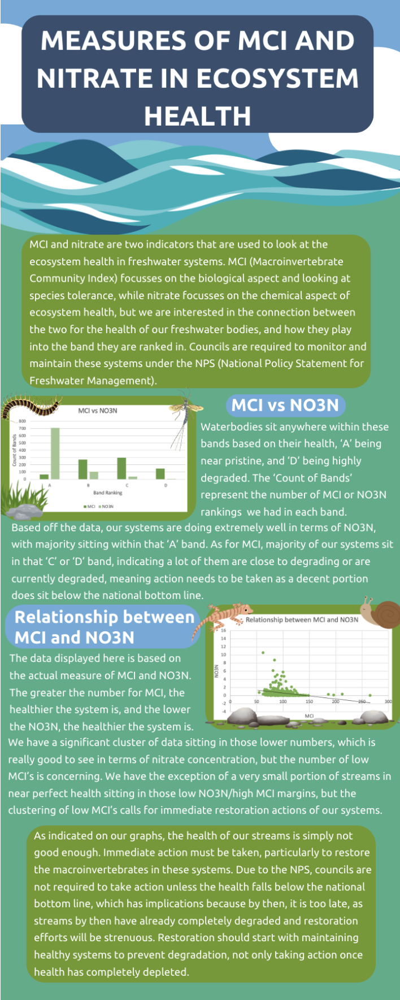
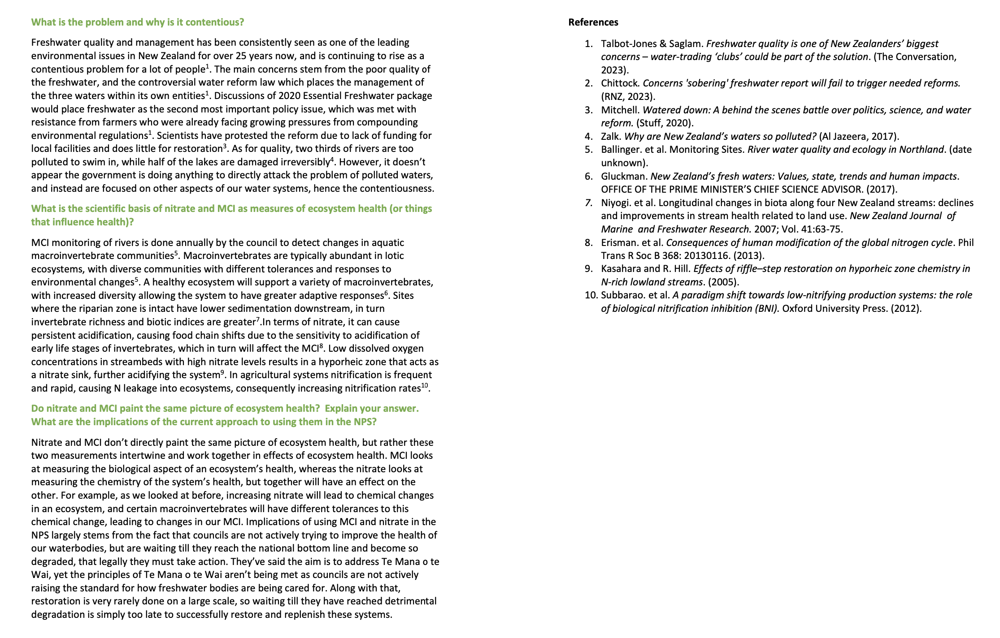

```{r setup, include=FALSE}
knitr::opts_chunk$set(echo = FALSE)
```
Welcome to my 'Freshwater' assignment that I did as part of ENVSCI 201: Natural and Human Environmental Systems. The skills that I have gained through this assignment involve working with environmental data and looking at how environmental health is assessed and managed. I also took out some research, looking for peer-reviewed and grey literature where they discuss the scientific basis of nitrate and MCI measures of ecosystem health. 

In the construction of the infographic we practiced manipulating environmental data and looked at how environmental health is managed in freshwater ecosystems. I was able to learn some excel functions in the creation of the two graphs, in order to visualise attribute bands based on MCI and nitrate, and discover if there is a correlation. 


Then we were provided with a series of three questions, where we had to carry out some research on peer-reviewed literature and grey literature to provide answers for the questions. For the first question, we were asked to look for material in the media, while the second question asked that we use peer-reviewed and grey literature. In the final question, I analysed the graphs created using the environmental data, and compared the effects of MCI and nitrate in assessing ecosystem health. 

