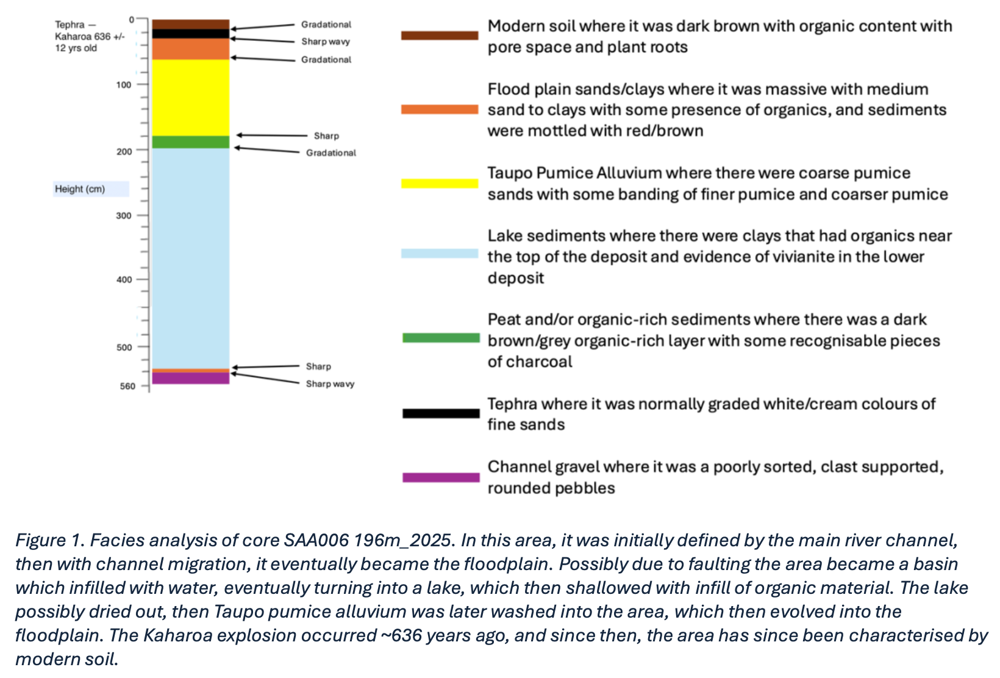
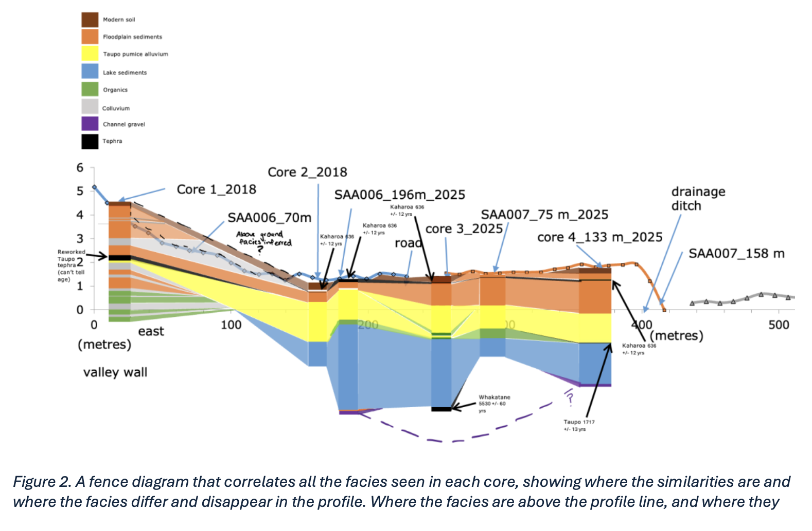
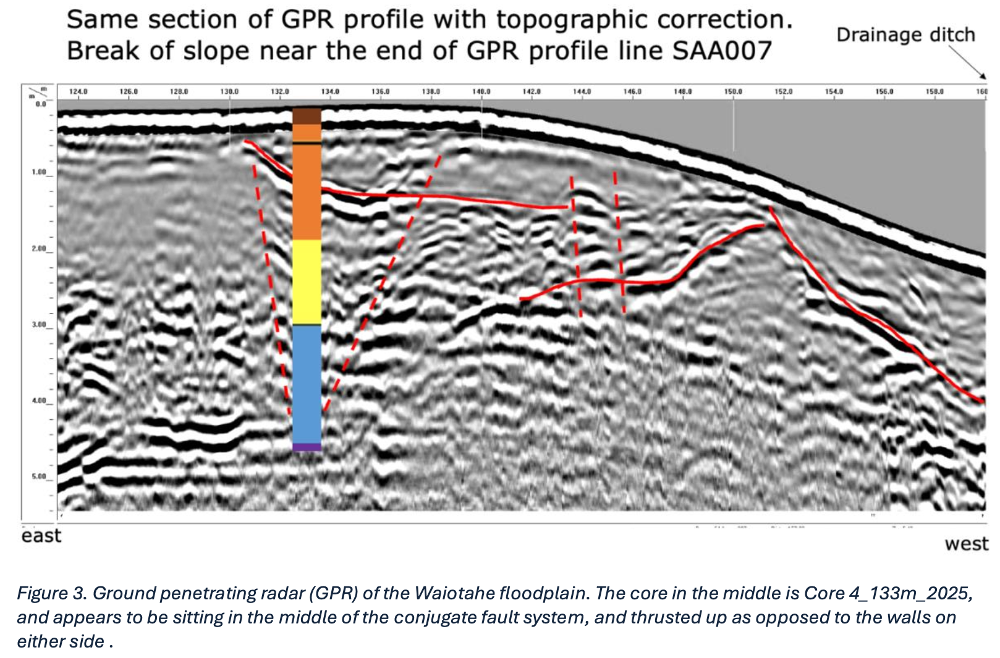
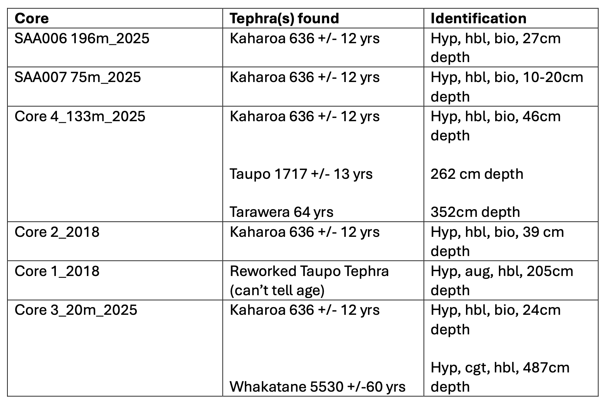
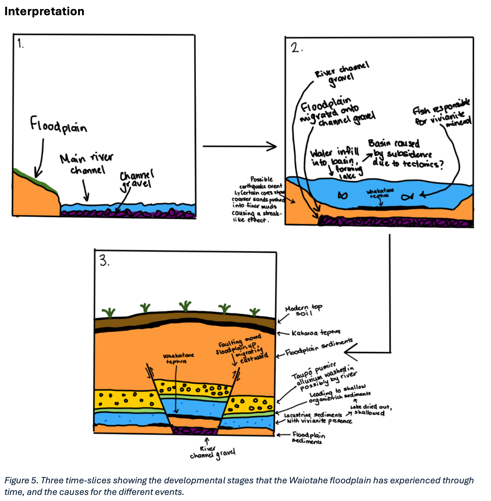

```{r setup, include=FALSE}
knitr::opts_chunk$set(echo = FALSE)
```
Welcome to my Waiotahe Floodplain Evolution Exercise that I completed as a part of EARTHSCI 303: Sedimentary Systems! The main focus of this exercise was to gain some experience with core logging, and paleoenvironmental analyses using logged cores and other subsurface data, including ground penetrating radar (GPR). 

Through this exercise I was able to enhance and develop my core logging skills, looking specifically at changing grain sizes and changing sediments with depth, and looking at what this means in terms of its paleoenvironment. I was able to recognise changes from river channel to deep lake to floodplain. I was even able to piece together paleoseismic events, such as an earthquake event and paleotectonics of the area. This assignment provided me with a new way of interpreting and evaluating paleoenvironments and events that happened in the past, that shape the current landscape today. 

**Core Logging**

For the [**core logging**](https://drive.google.com/file/d/1_K_8Bm1qRb2WNG-PRpA4t-VUqbn-F0Mk/view?usp=sharing), we were assigned a specific core in a particular location along the length of the floodplain, where we created a centimetre scale detailed log containing grain size, structure, contact, and other details such as colour and organics. We then provided detailed comments of the sediments origin, paleoenvironmental interpretation, compaction, and any other sedimentological details. 

**Facies Diagram**

Based off our respective core, I constructed a facies diagram, whereby using the details of the core log, the facies with the changing sediments were interpreted. The facies analysis helped us realise the changes in paleoenvironments of the area, and we were able to analyse the shift in the main river channel, floodplain evolution, volcanic eruptions, and paleotectonic events. 


**Fence Diagram**

Based on every groups facies diagrams, we were able to match facies and create a fence diagram. The fence diagram allowed us to view the migration of certain facies types, and disappearances, piecing together the paleoenvironmental evolution of the general area. 


**Ground Penetrating Radar Image**

Using the GPR image of the floodplain, we were able to see that there was a conjugate fault system in the area, and we found one specific core was from the middle of the conjugate fault, so I was able to directly analyse the vertical uplift and tectonic setting.


**Tephra Identification**

Using a microscope and tephra found in the cores, we were able to look at the mineral assemblage in particular tephras. By looking at the mineral assemblage in combination with its depth in the core, we were able to piece together the specific eruption the tephra came from, and therefore able to date the cores. 


**Timescale and Final Interpretation**

Finally, using all the data collected from the cores, I put together a three-interval timescale of my interpretation of the evolution in the Waiotahe floodplain. 


• Initially, the area likely started out as the main river channel, which then eventually progressed into the floodplain as the channel migrated due to erosion/deposition (refer to Fig. 5., time-slice 1, and the lowermost facies in Fig. 1., 2., 3.)

• The Whakatane eruption then occurred, ~5530 ybp (refer to Fig. 4.), where in certain areas tephra was preserved, particularly in the area where core 3_2025 was extracted (refer to Fig. 2.).

• As subsidence occurred, likely with faulting/tectonics, a basin formed and was infilled with water, forming a lacustrine environment. This resulted in the deposition of fine-grained lake sediments, with vivianite presence, indicating the lacustrine environment. At the same time, the valley wall is defined by a series of interchanging organic/colluvium sediments as material is being brought in (refer to core 1_2018 in Fig. 2.)

• An earthquake event then shook up the floodplain sands into the lake sediments (refer to sheet 6/7 in the core sheet description).

• The lake shallowed with the presence of organic sediment, where the Taupo pumice alluvium was then washed in, possibly by the river, but as the lake dried out, the floodplain then migrated onto this area.

• Potentially in between the lake and Taupo pumice alluvium, there was an influx of Taupo tephra, but it is unsure whether the reworked and the ~1717 ybp eruption from Fig 4. are the same.

• With faulting, the floodplain was pushed up, and migrated eastward towards the valley wall, which occasionally would get an influx of colluvium, then return to floodplain (refer to Fig. 2. for core 1_2018, and Fig 3. for GPR image showing fault system).

• The Kaharoa explosion then occurred, covering majority of the area with a layer of tephra (refer to Fig. 1., 2., 3. for where the lateral expanse of tephra).

• Eventually we have come to present day, where the area is now still the floodplain, but the uppermost facies is now defined by a thin layer of modern topsoil (refer to Fig 1., 2., 3., 5., showing the vertical extent of topsoil).


